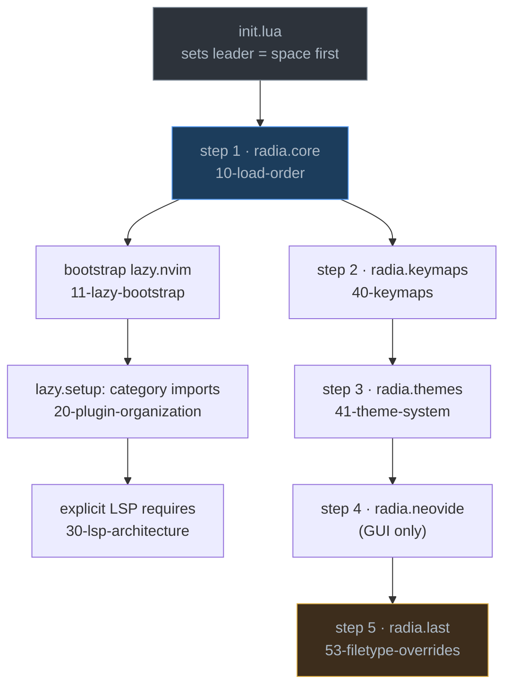
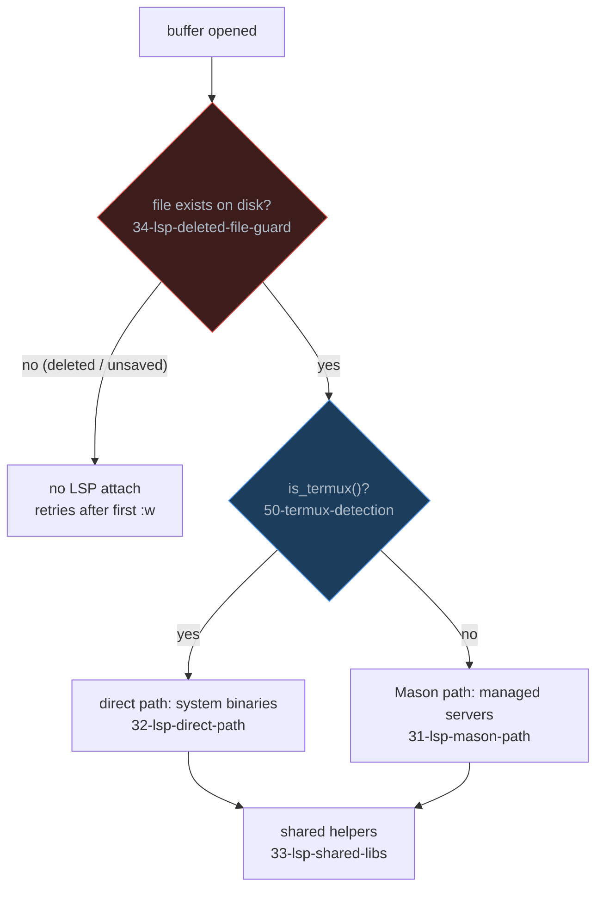

# 🧠 Brain — radia nvim config

Root of the knowledge graph. Each leaf is an **atomic note**: one concept, one file, linked by `[[wikilinks]]` and tagged into [[tags]].

> **Convention:** notes are atomic (a single idea), self-contained, and connected — not chaptered. To learn a topic, open its note and walk its links.

## How notes are numbered (flow)

The filename prefix encodes **where the concept sits in the flow** of this config, so an alphabetical file listing reads as the startup story:

| Prefix | Cluster | Meaning |
|--------|---------|---------|
| `1x` | Bootstrap & flow | how nvim comes up, in what order, how to verify |
| `2x` | Plugins | spec organization, pinning, plugin-level gotchas |
| `3x` | LSP | the two-path LSP architecture and its guards |
| `4x` | UI & input | keymaps and theming (load-order steps 2–3) |
| `5x` | Cross-platform | the Termux/Windows dimension that cuts across everything |
| `6x` | Outside the runtime | psmux/Nushell tooling that is *not* nvim config |

`index.md` (this file) and [[tags]] stay unnumbered — they are the maps, not the territory.

## Startup flow

What happens when `nvim` launches, and which note owns each step:

## LSP attach decision

How a buffer ends up with (or without) a language server:

## Tree

- **1x · Bootstrap & flow** — how nvim comes up
  - [[10-load-order]] — strict five-step require sequence in `init.lua`
  - [[11-lazy-bootstrap]] — how lazy.nvim installs itself and loads specs
  - [[12-verification]] — no test runner; how to validate a change
- **2x · Plugins** — specs and their lifecycle
  - [[20-plugin-organization]] — category folders → `{ import }`
  - [[21-disabled-plugins]] — the dormant `disabled/` directory
  - [[22-pinned-commits]] — inline `commit =` is the real lockfile
  - [[23-formatting-on-save]] — conform.nvim; black timeout → libuv race
  - [[24-telescope-previewer-no-shell]] — don't spawn `head`/`echo` (Windows trap)
- **3x · LSP** — two parallel setup paths
  - [[30-lsp-architecture]] — the hub: one config, two paths
  - [[31-lsp-mason-path]] — desktop, Mason-managed
  - [[32-lsp-direct-path]] — Termux, system binaries
  - [[33-lsp-shared-libs]] — `lib/` helpers both paths share
  - [[34-lsp-deleted-file-guard]] — no attach when the file is gone from disk
- **4x · UI & input** — steps 2–3 of the load order
  - [[40-keymaps]] — keymap load chain
  - [[41-theme-system]] — `_G.themesname` set in core, applied in themes
- **5x · Cross-platform** — the dimension that cuts across everything
  - [[50-termux-detection]] — the `com.termux` switch
  - [[51-windows-pwsh]] — pwsh shell wiring
  - [[52-clipboard]] — deferred enable + Termux provider
  - [[53-filetype-overrides]] — extension → filetype remaps
- **6x · Outside the runtime** — adjacent tooling, not nvim config
  - [[60-nupsmux]] — psmux/Nushell session tooling
  - [[61-psmux-key-shadowing]] — `bind-key -n` steals keys from nvim

## Indexes

- [[tags]] — every tag and the notes under it

Tags: [[tags#moc|#moc]] · [[tags#core|#core]]
